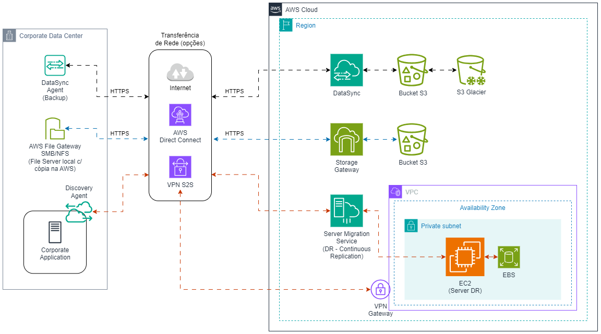

# Arquitetura hibrida On-premises/AWS para Backup e DR

Diagrama de uma Arquitetura básica híbrida entre ambientes On-premises e Cloud AWS para Backup de arquivos e Disaster Recovery de uma Aplicação Corporativa legada.

## Serviços da AWS utilizados

### Sincronização de backups de arquivos

- AWS DataSync
- AWS DataSync Agent
- Amazon S3
- Opções de conectividade: Internet / AWS Direct Connect / AWS VPN S2S

### File Server local com cópia de segurança na AWS

- AWS Storage Gateway
- AWS File Gateway (SMB/NFS)
- Amazon S3
- Opções de conectividade: Internet / AWS Direct Connect / AWS VPN S2S

### Disaster Recovery da Aplicação Corporativa Legada (*)

- AWS Server Migration Service (Continuous Replication - DR)
- AWS Discovery Agent
- Network VPC, Subnet e VPN Gateway
- Amazon EC2
- Conectividade: AWS VPN S2S

(*) DR contra falhas do Data Center On-premises: hardware, SO e storage

## Diagrama da Arquitetura

