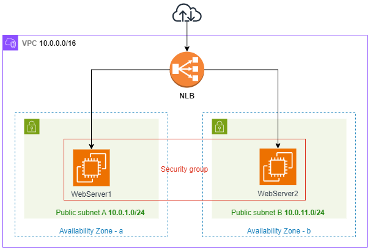
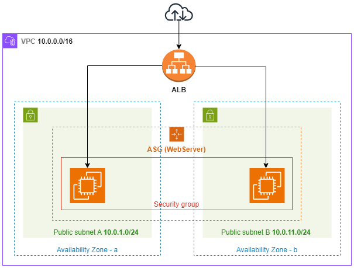

# Arquitetura de Balanceadores de Carga na AWS

Diagramas de Arquiteturas para implementação de Load Balancers na AWS (Elastic Load Balancers - ELB).

## ELB do tipo Network Load Balancer

### Serviços da AWS utilizados para ELB-NLB

- Network: VPC, Subnets e Security Groups
- AWS Load Balancer do tipo NLB
- Instâncias EC2

### Diagrama da Arquitetura ELB-NLB

## ELB do tipo Application Load Balancer com Auto Scaling Group (ASG)

### Serviços da AWS utilizados para ELB-ALB com ASG

- Network: VPC, Subnets e Security Groups
- AWS Load Balancer do tipo ALB
- Auto Scaling Group (ASG)
- Instâncias EC2

### Diagrama da Arquitetura ELB-ALB

