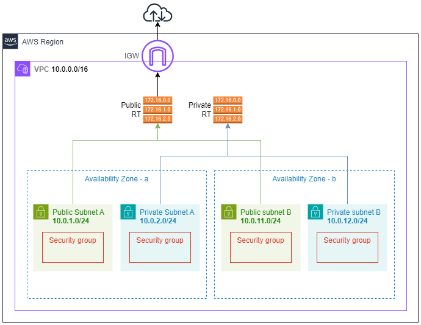

# Arquitetura básica de Redes (VPC) na AWS

Diagrama de uma Arquitetura básica de redes usando os principais serviços correspondentes na AWS.

## Serviços da AWS utilizados

- VPC
- Subnets
- Internet Gateway (IGw)
- Route Tables (RT)
- Security Groups

## Diagrama da Arquitetura

